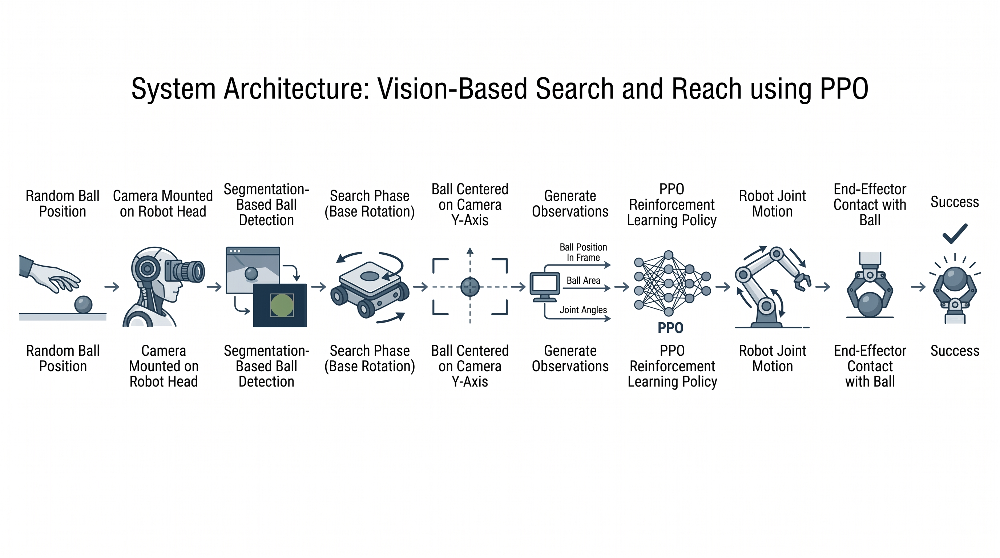
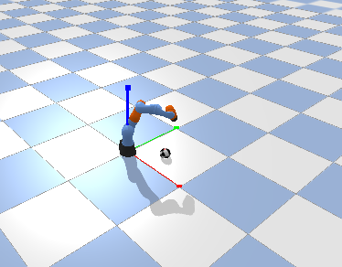
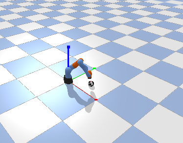
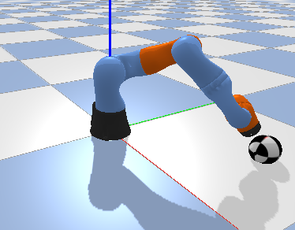

# Vision Guided Robotic Ball Reaching  
**Author:** Swapnadeep Paty


A PyBullet + PPO (Stable-Baselines3) project that demonstrates an **end-to-end “Search → Align → Reach → Contact”** pipeline for robotic manipulation.  
This repo contains **two prototypes** to show the evolution from a geometry-based baseline to a vision-guided final system.

---

## System Architecture


---

## Prototypes

### Prototype 1 — Geometry-Based (Baseline)
- Uses **true simulator geometry** (relative position) as observation.
- Base joint performs a **distance-based scan** to select the best orientation.
- PPO controls joints to reach the ball.


### Prototype 2 — Vision-Based (Final)
- Uses a **virtual camera attached to the end-effector** + PyBullet **segmentation mask**.
- **Search phase** rotates the base until the ball is centered in camera view (x≈0).
- PPO controls joints to reach and touch the ball.



---

## Demo Screenshots

| Stage | Screenshot |
|------|------------|
| Search phase |  |
| Reaching phase |  |
| Contact |  |

---

## Demo Videos

- Prototype 1 demo: `assets/videos/prototype1_demo.mp4`
- Prototype 2 demo: `assets/videos/prototype2_demo.mp4`

> GitHub may not inline-play MP4 in README on all views. If the video doesn’t play, click the file in the repo to view/download.

---

## Results

- Prototype 1: see `results/prototype1_test_results.txt`
- Prototype 2: see `results/prototype2_test_results.txt`

---

## Installation

```bash
python3 -m venv rl_env
source rl_env/bin/activate
pip install -r requirements.txt

Quick sanity check:

python -c "import pybullet, gymnasium, stable_baselines3, torch; print('All OK')"
Run Prototype 1

Train:

python3 Prototype_1_Geometry_Based/train.py

Test:

python3 Prototype_1_Geometry_Based/test.py
Run Prototype 2 (Final)

Train:

python3 Prototype_2_Vision_Based_Final/train.py

Test (Search + Reach + Accuracy):

python3 Prototype_2_Vision_Based_Final/test.py
Models

Trained models are included in:

models/prototype1_model.zip
models/prototype2_model.zip

Note: Stable-Baselines3 loads models using the filename without “.zip” in code.